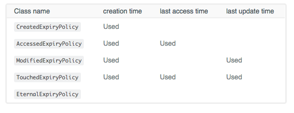

<h4> Build you own Apache Ignite persistence with Scala

In previous post about Apache Ignite, we learnt how to setup and create either a simple cache or sql cache, and share the 
cached data between different nodes.
In this post we will go a little bit deeper. We will see what to do in the case that our app crashes because the cached data will disappear. How could Ignite help us to avoid
this problem?

Let's suppose that we are working on a real time iot application, designed to receive events from devices such as
temperature devices, gps, or events from raspberry sensors.
We assume that an event has organizational data that is static like an event id, metadata, lat-long coordinates for geospatial queries (shortest route maybe).
It also exists a backoffice application through which the users can create the devices metadata based on an
unique id (the same as the received events), like the imei, or gpio , etc. 

Sensors can send events every minute or less, in the case of the gps. We often come up against the requirement of enrich the dynamic 
data with the static data, with the plus that the devices usually are waiting the ack message.
How can Apache Ignite help us with this situation? static data and dynamic data in multiple microservices for example?
Well, besides using the cache benefits of Ignite as we have seen in previous post, replication, repartition, queries,
Does Ignite have just persistence for the cached data? let`s take a deeper look at this point 

######Persistence

There are a variety of databases that are suitable for persist data, but how many in-memory platforms provide cache and 
store without boilerplate code?

A simple example to show how it works (We will use Postgres as database, and Scala)

Let's start!, add the following dependencies in your build.sbt file:

    libraryDependencies ++= Seq(
       "org.apache.ignite" % "ignite-core" % "2.6.0",
       "org.postgresql" % "postgresql" % "42.2.4"
    )

Then configure Ignite cache as usual, adding the persistence properties
 
    val NativePersistence = "device_native"
    
Where data will be stored
    
    val PersistencePath = "/tmp/ignite"
    
Where write-ahead log will be stored
    
    val WalPath = "/tmp/wal"
    
    val config = new IgniteConfiguration()

> The purpose of the WAL is to provide a recovery mechanism for scenarios where a single node or the whole cluster goes down
      
In this section, we configure cache backup nodes, cache mode, and expiration policy for the data, for an overview
check Partition and Replication on previous post 
      
    val cacheCfg = new CacheConfiguration(NativePersistence)
    cacheCfg.setBackups(1)
    cacheCfg.setCacheMode(CacheMode.REPLICATED)
    cacheCfg.setWriteSynchronizationMode(CacheWriteSynchronizationMode.FULL_SYNC)
    cacheCfg.setExpiryPolicyFactory(CreatedExpiryPolicy.factoryOf(new javax.cache.expiry.Duration(TimeUnit.SECONDS, 30)))
  
Here, we say to Ignite, that we want to persist the cache enabling the persistence
  
    val storageCfg = new DataStorageConfiguration()
    storageCfg.getDefaultDataRegionConfiguration().setPersistenceEnabled(true)
    storageCfg.setStoragePath(PersistencePath)
    storageCfg.setWalPath(WalPath)
    storageCfg.setWalArchivePath(WalPath)
    config.setDataStorageConfiguration(storageCfg)
    config.setCacheConfiguration(cacheCfg)

     val ignition = Ignition.start(config)
     ignition.cluster().active(true)

     val cache = ignition.getOrCreateCache[Int, Device](NativePersistence)

     def random(min: Int, max: Int): Double = {
       val r = new Random
       min + (max - min) * r.nextDouble
     }

     for (i <- 1 to 100) {
       cache.put(i, Device(i.toString, s"metadata $i", random(-90, 90), random(-180, 180)))
     }
  
 
And that's all! , lets run the app to show how it works

    [18:19:14] Data Regions Configured:
    [18:19:14]   ^-- default [initSize=256.0 MiB, maxSize=1.6 GiB, persistenceEnabled=true]

And navigating to /tmp, you will see <b>/tmp/ignite</b> and <b>/tmp/wal</b> directories. 
To be sure that it works, just start another instance of the app changing this line

    cache.put(i, Device(i.toString, s"metadata $i", random(-90, 90), random(-180, 180)))

for this one

    println(s"Get device ${cache.get(i)}")
    
then the output will look like this

    [18:54:25]   ^-- default [initSize=256.0 MiB, maxSize=1.6 GiB, persistenceEnabled=true]
    Get device Device[id = 1 - metadata = metadata 1 - lat = -77.53427731362423 - lon = 29.076159947913908}
    Get device Device[id = 2 - metadata = metadata 2 - lat = -35.7678515281638 - lon = -13.232386332299711}
    Get device Device[id = 3 - metadata = metadata 3 - lat = 11.884412857887412 - lon = 95.16134531018974}

wait until the configured expiry policy time ends and try again to see the results.

######Baseline Topology
If Ignite persistence is enabled, Ignite will enforce the baseline topology concept which represents a set of server nodes 
in the cluster that will persist data on disk. 
Usually, when the cluster is started for the first time with Ignite persistence on, the cluster will be considered inactive 
disallowing any CRUD operations, to enable the cluster, you will need to:

    ignition.cluster().active(true)

######Expiry Policies
  - In-Memory Mode (data is stored solely in RAM): expired entries are purged from RAM completely.

  - Memory + Ignite persistence: expired entries are removed from memory and disk tiers.

  - Memory + 3rd party persistence: expired entries are just removed from the memory tier (Ignite) and kept 
  the 3​rd party persistence (RDBMS, NoSQL, and other databases) intact.

> Note: By default, Ignite nodes consume up to 20% of the RAM available locally

Great, we have our persistence data in a specific path, in each node, so if a device send an event we will enrich
the message with static metadata, but ...

Above I mentioned that the user can persist the devices metadata in a database. If this is the case, then our native persistence
has been "pre loaded" as a database, and for each update, the application will must update the database and refresh the 
associated value in the cache.

If the cache always depends on a database, is there any possibility to associate database actions to the cache??
Maybe... Does Ignite have a way to put/load data into/from cache through a database???  (Reminder : Postgres is the database)

######3rd Party Persistence

> Note: Postgres > 9.x is required 

    import javax.cache.configuration.FactoryBuilder
    
    val JdbcPersistence = "device_ignite_table"   
    val cacheCfg = new CacheConfiguration[String, Device](JdbcPersistence)
    cacheCfg.setBackups(1)
    cacheCfg.setCacheMode(CacheMode.REPLICATED)
    
    cacheCfg.setCacheStoreFactory(FactoryBuilder.factoryOf(classOf[CacheJdbcStore]))
    cacheCfg.setReadThrough(true)
    cacheCfg.setWriteThrough(true)  
    config.setCacheConfiguration(cacheCfg)
    
    val ignition = Ignition.start(config)
    val jdbcCache = ignition.getOrCreateCache[String, Device](JdbcPersistence)
   
CacheStoreFactory is our 3rd party persistence layer, in which, how to access/read data from the database to/from Ignite is 
managed

    class CacheJdbcStore extends CacheStoreAdapter[String, Device] ...
    
If you want to define your cache store adapter, you just have to extend from CacheStoreAdapter[K,V] class, that provides
implementations for commons methods, such as 

- Load all
- Write all
- Delete all

> Ignite provides `org.apache.ignite.cache.store.CacheStore` interface which extends both, `CacheLoader` and `CacheWrite`

In our example, we will use, mostly, two of this methods: **write** and **load**

Write method, related to `cacheCfg.setWriteThrough(true)`. Setting it as `true`, means putting a value into the cache but, under the hood,
it calls write method. With it set to `false`, write method it's never called.
    
      override def write(entry: Cache.Entry[_ <: String, _ <: Device]): Unit = Try {
        // Must be an UPSERT
        val ps = connection.prepareStatement("INSERT INTO device_ignite_table (id,metadata,lat,lon) VALUES (?,?,?,?)")
        ps.setString(1, entry.getKey)
        ps.setString(2, entry.getValue.metadata)
        ps.setDouble(3, entry.getValue.lat)
        ps.setDouble(4, entry.getValue.lon)
        ps.executeUpdate()
      } match {
        case Success(_) => println(s"Value put in table")
        case Failure(f) => println(s"Insert error $f")
      }

The same with read, `cacheCfg.setReadThrough(true)`, with `true` value, if the values is not in cache then it will look for it in the database

    override def load(key: String): Device = {
        println(s"load key $key")
        val ps = connection.prepareStatement(s"SELECT * FROM device_ignite_table where id = '$key'")
        val rs = ps.executeQuery()
        if (rs.next())
          rsToDevice(rs)
        else
          null
      }

> In both cases, table name is the same as cache name

If we put some data in `jdbcCache'

    for (i <- 1 to 10) {
        jdbcCache.put(i.toString, Device(i.toString, s"metadata $i", random(-90, 90), random(-180, 180)))
    }

 
With this approach, our cache can always be updated!! and depending of the case, read or write from the database is configurable.
Besides this methods, cacheStore provides, `delete` and `loadCache`. 
Imagine, you can use postgres to save your app data, and maybe have a read only cache for our dashboard view, as in the 
example. Or even better, a write only cache where to put data in cache+postgres and read from read only cache.

Bonus track : CacheStoreAdapter using Slick. 
> Slick is a Functional Relational Mapping (FRM) library that makes it easy to work with relational databases

I left the load method subject to free Future[_] interpretation  ;)

######Conclusion
Ignite provides us this powerful tool to be able to maintain our data in memory or in memory+native or in memory+nosql or in memory+jdbc. It is
very flexible and can be adapted to our architectures.
Is It possible to use this in a CQRS model?
 

######Related Links

[Source Code](https://github.com/gastonlucero/ignite-persistence)

[Backups](https://apacheignite.readme.io/docs/primary-and-backup-copies)

[BaseLine Topology](https://apacheignite.readme.io/docs/baseline-topology)

[Expiry Policies](https://apacheignite.readme.io/docs/expiry-policies)

[3rd Party Persistence]()https://apacheignite.readme.io/docs/3rd-party-store)

[Slick](https://slick.lightbend.com/doc/3.2.3/introduction.html)

Build docker image 

    docker build . -t ignite-persistence-native

Run image

    docker run  -p 8080:8000 <name>
